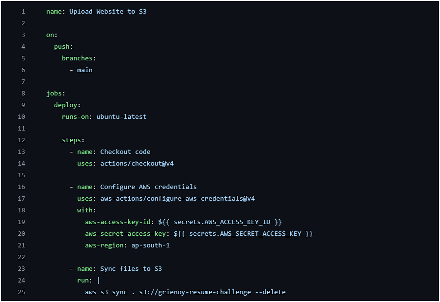
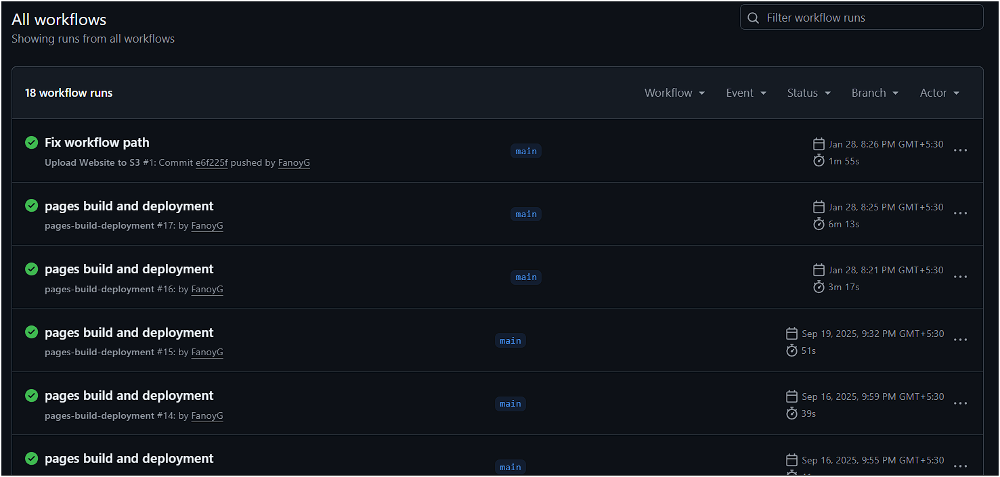
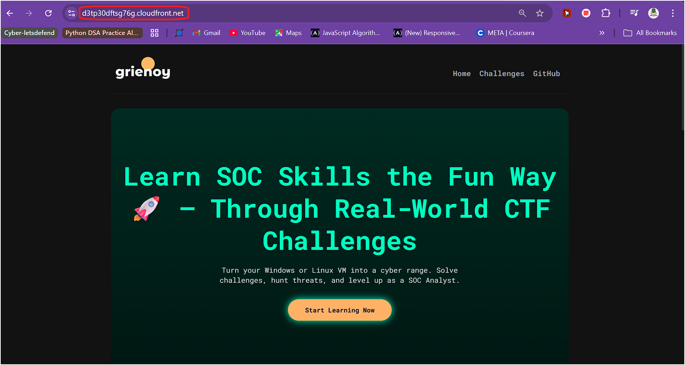
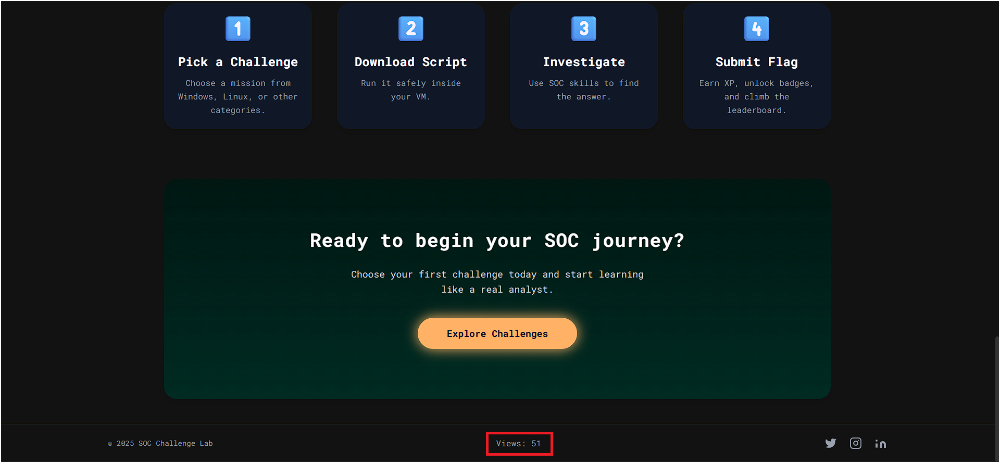

# ☁️ Secure Serverless Static Website with CI/CD on AWS

> **Production-style serverless web application deployment** with private S3 origin, CloudFront delivery, automated CI/CD via GitHub Actions, and a serverless view counter powered by Lambda + DynamoDB.

🔗 **Live Site:** [View on CloudFront →](https://fanoyg.github.io/griEnoy/) <!-- Replace with your CloudFront URL -->

---
## 🚀 Key Features

- Fully automated CI/CD pipeline using GitHub Actions
- Secure static hosting with private S3 + CloudFront (OAC)
- Serverless backend using Lambda + DynamoDB
- Real-time view counter with API integration
- Production-style deployment and debugging workflow

---
## 📌 What This Project Does

This project demonstrates how to **design, secure, and fully automate** the deployment of a static website on AWS — using the same patterns engineers follow in production environments.

The focus is **not** just hosting a website. It's about:
- Enforcing **zero direct S3 access** using Origin Access Control
- **Automating deployments** so no human touches the server
- Building a **serverless backend** for dynamic functionality
- **Debugging real issues** — IAM errors, CORS misconfigs, type serialization failures

> **Built for:** AWS Cloud Engineering · DevOps · Serverless · CI/CD Automation

---

## 🏗️ Architecture

```
User → CloudFront → S3 (private, static content)
User → CloudFront → Lambda Function URL → DynamoDB (view counter)
```

**Full request flow:**

```
┌─────────┐     HTTPS      ┌──────────────┐    OAC only    ┌──────────────┐
│  User   │ ─────────────► │  CloudFront  │ ─────────────► │  S3 Bucket   │
│         │                │  (Edge CDN)  │                │  (Private)   │
└─────────┘                └──────┬───────┘                └──────────────┘
                                  │
                                  │ Lambda Function URL
                                  ▼
                           ┌──────────────┐    Read/Write   ┌──────────────┐
                           │    Lambda    │ ─────────────── │   DynamoDB   │
                           │  (Counter)   │                 │  (View Count)│
                           └──────────────┘                 └──────────────┘
```

<!-- 📸 ADD SCREENSHOT: architecture-diagram.png -->


**Key design decisions:**
- S3 bucket has **public access fully blocked** — CloudFront is the only allowed origin via OAC
- Lambda uses a **Function URL** (no API Gateway) — simpler, cheaper for this scale
- Route 53 intentionally not used — CloudFront default domain is sufficient without a purchased custom domain

---

## 🔒 Security Layers

```
Layer 1: HTTPS Encryption (enforced at CloudFront edge)
         │
         ▼
Layer 2: Origin Access Control (OAC)
         CloudFront → S3 only. Direct S3 access = denied.
         │
         ▼
Layer 3: Private S3 Bucket
         Public access blocked at bucket and account level.
         │
         ▼
Layer 4: IAM Least Privilege
         Lambda role scoped to DynamoDB only.
         GitHub Actions role scoped to S3 sync + CloudFront invalidation only.
         │
         ▼
Layer 5: Secrets Management
         AWS credentials stored in GitHub Secrets — never in code.
```

**CORS** is explicitly configured in a single location to avoid browser-side request blocking (a real debugging lesson — documented below).

---

## 🚀 CI/CD Pipeline


> Automated deployment triggered on every push to main branch



```
git push main
      │
      ▼
┌─────────────────┐
│  GitHub Actions │  ◄── Workflow triggered
└────────┬────────┘
         │
         ├── 1. Checkout code
         ├── 2. Configure AWS credentials (from GitHub Secrets)
         ├── 3. Sync files to S3  (aws s3 sync)
         └── 4. Invalidate CloudFront cache
                    │
                    ▼
             ┌──────────────┐
             │  Live Site   │  ✅ Deployed in ~60 seconds
             └──────────────┘
```

> ⚠️ **Note:** CloudFront caching may delay visible updates. The pipeline includes an automatic cache invalidation step to handle this.

---

## 👁️ View Counter — Serverless Backend

A dynamic view counter built entirely on serverless AWS services.

```
User visits website
       │
       │ JavaScript Fetch (on page load)
       ▼
Lambda Function URL
       │
       ├── 1. Read current count from DynamoDB
       ├── 2. Increment value
       └── 3. Write new value back
               │
               ▼
       Returns { count: 43 }
               │
               ▼
     Website displays: "Views: 43 👁️"
```

**DynamoDB table structure:**

| Key | Type | Value |
|---|---|---|
| `id` (Partition Key) | String | `"count"` |
| `value` | Number | `43` |

---

## ✅ Confirmed Results

<!-- 📸 ADD SCREENSHOT: live-site.png -->

*Live website served securely via CloudFront with a private S3 origin.*

<!-- 📸 ADD SCREENSHOT: view-counter-live.png -->

*Dynamic view counter powered by Lambda and DynamoDB, showing real-time incremented views.*

- ✅ Website deployed and live via CloudFront HTTPS
- ✅ S3 bucket fully private — direct access blocked
- ✅ CI/CD pipeline deploys automatically on every `git push`
- ✅ View counter reads and increments correctly via Lambda + DynamoDB
- ✅ All IAM roles scoped to minimum required permissions

---

## 🪲 Challenges & Debugging Lessons

Real issues encountered and solved — not a tutorial walkthrough.

---

### ❌ Issue 1: Lambda Returning 500 Errors

**Symptom:** View counter not loading; Lambda returning 500.

**Root Cause:** Lambda execution role was missing DynamoDB permissions.

**Fix:** Added `dynamodb:GetItem` and `dynamodb:PutItem` to the Lambda IAM role.

```json
{
  "Effect": "Allow",
  "Action": [
    "dynamodb:GetItem",
    "dynamodb:PutItem"
  ],
  "Resource": "arn:aws:dynamodb:REGION:ACCOUNT:table/TABLE_NAME"
}
```

> **Lesson:** Lambda execution roles need explicit permissions for every AWS service they touch. Default roles have nothing.

---

### ❌ Issue 2: JSON Serialization Failing on DynamoDB Response

**Symptom:** Lambda returned an error when trying to send the count back to the frontend.

**Root Cause:** DynamoDB returns numeric values as Python `Decimal` objects, not native integers. `json.dumps()` can't serialize `Decimal`.

**Fix:** Explicitly convert before returning:

```python
count = int(response['Item']['value'])
return {'count': count}
```

> **Lesson:** DynamoDB's Python SDK returns `Decimal` for all number types. Always convert before JSON serialization.

---

### ❌ Issue 3: Browser Blocking API Requests (CORS Error)

**Symptom:** Frontend JavaScript fetch to Lambda was blocked by the browser.

**Root Cause:** CORS was configured in multiple places (Lambda response headers + CloudFront), causing conflicts and duplicate headers.

**Fix:** Configured CORS in **one place only** — the Lambda function response.

```python
return {
    'statusCode': 200,
    'headers': {
        'Access-Control-Allow-Origin': '*',
        'Content-Type': 'application/json'
    },
    'body': json.dumps({'count': count})
}
```

> **Lesson:** Configure CORS in a single authoritative location. Duplicate CORS headers across services cause conflicts that are hard to trace.

---

### ❌ Issue 4: CloudFront Serving Stale Files After Deployment

**Symptom:** Updated files pushed to S3 but the live site still showed old content.

**Root Cause:** CloudFront cached the previous version at the edge.

**Fix:** Added a CloudFront cache invalidation step to the GitHub Actions workflow:

```yaml
- name: Invalidate CloudFront Cache
  run: |
    aws cloudfront create-invalidation \
      --distribution-id ${{ secrets.CLOUDFRONT_DISTRIBUTION_ID }} \
      --paths "/*"
```

> **Lesson:** CloudFront caches aggressively. Deployments must include a cache invalidation step or users see stale content.

---

## 🛠️ Technologies Used

| Category | Tools |
|---|---|
| Static Hosting | Amazon S3 |
| CDN & Edge Delivery | Amazon CloudFront |
| Serverless Backend | AWS Lambda |
| Database | Amazon DynamoDB |
| Access Control | AWS IAM (OAC, least-privilege roles) |
| CI/CD | GitHub Actions |
| Frontend | HTML, CSS, JavaScript (Fetch API) |

---

## ⚙️ Setup

### Prerequisites

- AWS account
- GitHub repository
- AWS CLI configured (`aws configure`)

### Steps

**1. Clone the repository**
```bash
git clone https://github.com/FanoyG/secure-serverless-website
cd secure-serverless-website
```

**2. Create S3 bucket**
```bash
aws s3 mb s3://your-bucket-name
aws s3api put-public-access-block \
  --bucket your-bucket-name \
  --public-access-block-configuration "BlockPublicAcls=true,IgnorePublicAcls=true,BlockPublicPolicy=true,RestrictPublicBuckets=true"
```

**3. Create CloudFront distribution**
- Set S3 bucket as origin
- Enable Origin Access Control (OAC)
- Enforce HTTPS (redirect HTTP → HTTPS)
- Update S3 bucket policy to allow OAC only

**4. Deploy Lambda function**
- Create function with Python 3.x runtime
- Attach IAM role with `dynamodb:GetItem` and `dynamodb:PutItem`
- Enable Function URL with CORS configured

**5. Create DynamoDB table**
- Table name: `view-counter`
- Partition key: `id` (String)
- Create initial item: `{ "id": "count", "value": 0 }`

**6. Configure GitHub Actions**

Add these secrets to your GitHub repository:

| Secret | Value |
|---|---|
| `AWS_ACCESS_KEY_ID` | IAM user access key |
| `AWS_SECRET_ACCESS_KEY` | IAM user secret key |
| `AWS_S3_BUCKET` | Your S3 bucket name |
| `CLOUDFRONT_DISTRIBUTION_ID` | Your CloudFront distribution ID |

**7. Push to deploy**
```bash
git push origin main
```

GitHub Actions will sync to S3 and invalidate CloudFront automatically.

---

## 🔮 Future Improvements

- [ ] Add custom domain with Route 53 + ACM certificate
- [ ] Implement WAF rules for rate limiting and bot protection
- [ ] Add CloudFront access logs for traffic analysis
- [ ] Migrate infrastructure to Terraform for full IaC
- [ ] Add unique visitor tracking (not just total views)

---

## 👤 About

Built by **Adil Khan** — Cloud Engineer focused on AWS infrastructure, CI/CD automation, and secure serverless architecture.

- 🔗 GitHub: [github.com/FanoyG](https://github.com/FanoyG)
- 💼 LinkedIn: [linkedin.com/in/adil-khan-cloud](https://linkedin.com/in/adil-khan-cloud)
- 📧 adilkhan601782@gmail.com

> **Available for freelance AWS and cloud infrastructure projects.**  
> Open to cloud engineering internship opportunities.

---

## 📄 License

MIT License — free to use, modify, and reference with attribution.
